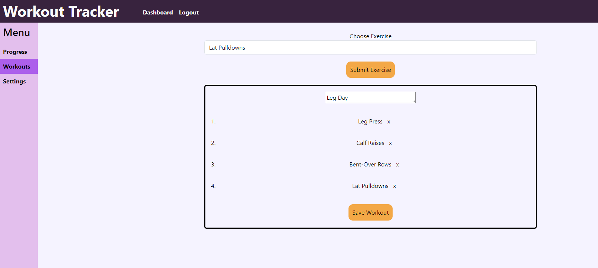
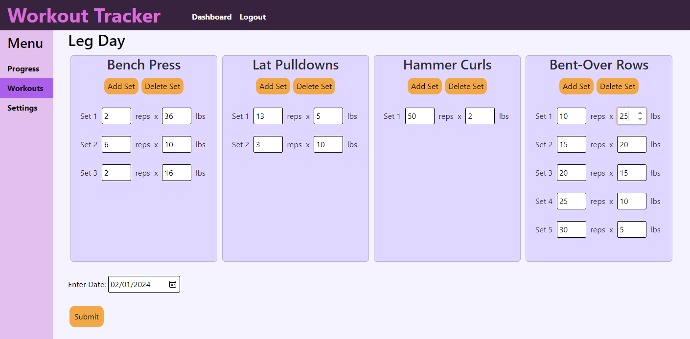
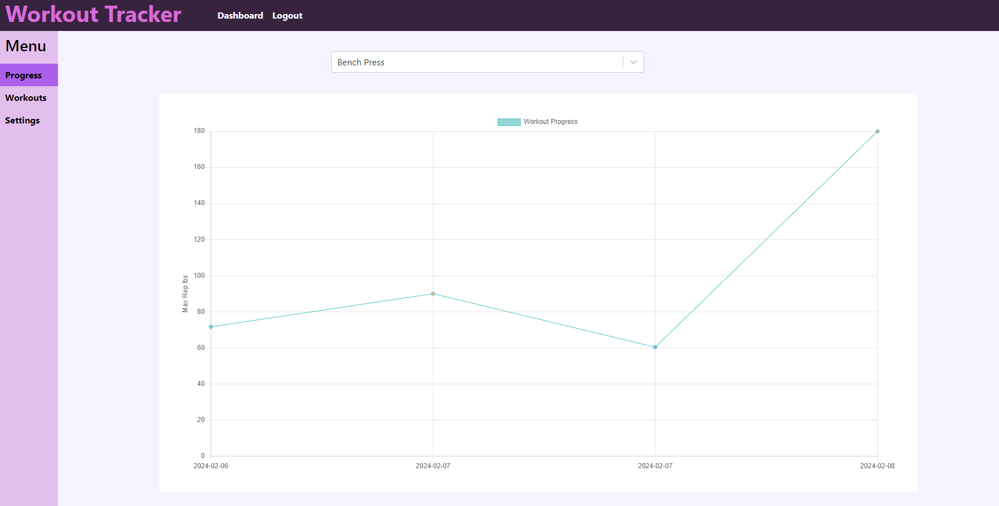

# Workout Tracker

## Description
This application can be used to track the progress of you workouts. It alows users to create custom workouts with exercises and sets. The user can input reps and weights to the sets and log the workouts to the database. The progress page shows the data from these logged workouts that you can view based on exercise. Each set outputs a calculated daily max rep value that can be charted over time. This is usefull to view your strength progress as you train.

site is deployed via heroku at:

https://still-fortress-13697-122e1b6f4e62.herokuapp.com/

## Table of Contents
- [Installation](#installation)
- [Usage](#usage)
- [License](#license)
- [Contributing](#contributing)

## Installation
Download code from the GitHub repository. Have Node.js installed. Link to Node.js downloads: https://nodejs.dev/en/download/. Then in the terminal install all the npm packages (listed under contributing) by inputting npm install. Make sure to connect the application to MongoDB and an apollo server.

To run the application input npm run dvelop in the terminal.
## Usage
When the use logs in they can create multiple workouts or choose from an existing workout in the worouts page. When creating a workout the user can choose from exsting exercises or make a new one. Once they submit the exercise it will appear on the workout list. Once all the desired exercises are on the list and the workout has a name, the user can save the workout. When it is saved it wil take the user back to the main workout page.

When the user chooses from their list of workouts, they will be taken to a log page. The log page will have al the exercises listed with the ability to input set data. The set data is the number of reps x the weight. These numbers will help calculate the max rep. the max rep formula being used is weight*(1 +(reps/30)). The final max rep saved is the average of all the sets in the exercise. On default the site will log the date as the current date, but the user has the option to choose a different date if desired.

Once the log page has been sumbitted the user will be taken to the progress page. The progress will show a graph of the max reps over the date. The user will need to choose the specific exercise from the dropdown menu to see the line graph.

All the information in the database is saved in the imperial system, but all the frontend information will be updated to metric if the user chose metric as their settings. The user can also change to light mode or dark mode. Both units of measurement and the theme settings infomation is saved in local storage and not the database.

## License
 This application is covered under MIT License.

You can click on the badge for further information.

## Contributing
Packages used:

- concurrently (runs server and client side at the same time): https://www.npmjs.com/package/concurrently

- express (server functions): https://www.npmjs.com/package/express

- mongoose (tool to interact with NoSql MongoDB): https://www.npmjs.com/package/mongoose

- jsonwebtoken (creates webtokens to help with user authentication): https://www.npmjs.com/package/jsonwebtoken

- jwt-decode (decodes the webtokens): https://www.npmjs.com/package/jwt-decode

- graphql (queries database): https://www.npmjs.com/package/graphql

- apollo server express (tool to check queries): https://www.npmjs.com/package/apollo-server-express

- chart.js (visualizes information in charts): https://www.npmjs.com/package/chart.js

- react (make web components): https://www.npmjs.com/package/react

- bootstrap (css framework): https://www.npmjs.com/package/bootstrap